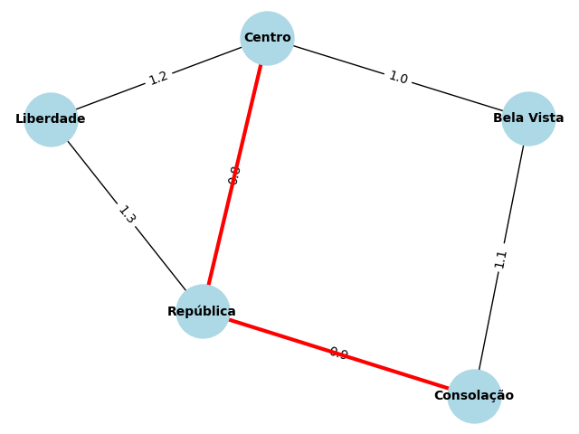
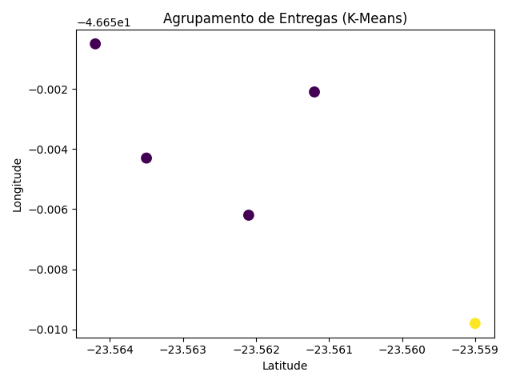

# Rota Inteligente: Otimização de Entregas com IA

Projeto desenvolvido para a disciplina **Artificial Intelligence Fundamentals**.  
O objetivo é aplicar algoritmos clássicos de Inteligência Artificial (A* e K-Means) para otimizar as rotas de entrega da empresa fictícia **Sabor Express**, reduzindo tempo e custo logístico.

---

## 1. Objetivo do Projeto

A empresa **Sabor Express** enfrenta dificuldades em gerenciar as rotas de entrega durante horários de pico.  
O objetivo deste projeto é desenvolver uma **solução inteligente** que:

- Encontre o menor caminho entre dois pontos (usando o algoritmo A*);
- Agrupe entregas próximas entre si (usando o algoritmo K-Means);
- Gere representações visuais das rotas e zonas de entrega otimizadas.

---

## 2. Abordagem Técnica

1. Representação da cidade como **grafo ponderado**, com bairros e distâncias.
2. Busca da melhor rota com o algoritmo **A*** (heurístico baseado em custo).
3. Agrupamento dos pedidos por **proximidade geográfica** com **K-Means**.
4. Geração automática de imagens (`grafo.png` e `agrupamento.png`) salvas na pasta `/docs`.

---

## 3. Tecnologias Utilizadas

| Categoria | Ferramenta |
|------------|-------------|
| Linguagem  | Python 3.11 |
| Bibliotecas | NetworkX, scikit-learn, Matplotlib, Pandas, NumPy |
| Visualização | Geração automática de gráficos (`grafo.png`, `agrupamento.png`) |
| Versionamento | Git e GitHub |

---

## 4. Resultados

- Cálculo do menor caminho entre os pontos da cidade com o algoritmo A*;
- Agrupamento eficiente das entregas com K-Means, reduzindo sobreposição de trajetos;
- Visualizações geradas automaticamente e salvas na pasta `/docs`.

---

## 5. Visualizações

### Grafo de Rotas (A*)

### Agrupamento de Entregas (K-Means)

---

## 6. Estrutura do Projeto

rota-inteligente/
┣ 📂 data/
┃ ┗ entregas.csv ← Dados de entrada (bairros e coordenadas)
┣ 📂 docs/
┃ ┣ grafo.png ← Mapa com a rota otimizada
┃ ┗ agrupamento.png ← Gráfico dos clusters (K-Means)
┣ 📂 src/
┃ ┣ grafo.py ← Implementação do grafo e A*
┃ ┣ clustering.py ← Agrupamento com K-Means
┃ ┗ main.py ← Execução principal
┣ 📄 requirements.txt ← Bibliotecas do projeto
┗ 📄 README.md ← Documentação do projeto

---

## 7. Referências

- Wired (2013) — *UPS ORION: How Math Saved Millions of Miles*  
  https://www.wired.com/2013/06/ups-astronomical-math  

- Medium — *Optimizing Logistics: Clustering and MILP*  
  https://medium.com/@KingHenryMorgansDiary/optimizing-logistics-a-case-study-on-clustering-and-milp-for-delivery-route-optimization-f47fed709ad2  

- ResearchGate — *AI-Powered Route Optimization*  
  https://www.researchgate.net/publication/389987796_AI-Powered_Route_Optimization  

- Kardinal.ai — *Fresh Product Delivery Case Study*  
  https://kardinal.ai/case-study-fresh-product-delivery  

---

## 8. Vídeo Pitch (até 4 minutos)

Apresente:

1. O problema enfrentado pela Sabor Express;  
2. O funcionamento dos algoritmos A* e K-Means;  
3. Os resultados e gráficos gerados;  
4. Conclusão sobre os benefícios obtidos.

Adicione o link do vídeo após a gravação:

**Link do vídeo (YouTube - não listado):**  
https://youtube.com
